# When the Black Box Isn't Worth It: Building a Credit Risk Model with Fairness Ground Truth

*A case study in challenger modeling: 800,000 loan applications, twelve model architectures, a fairness audit with a known answer key, and a glass-box model that kept 97% of the black box's lift.*

---

Replacing a credit scorecard is one of the most heavily governed changes a lender can make. The new model must beat the incumbent by enough to matter, explain every individual decline in regulator-approved language, prove it doesn't discriminate against protected classes, and survive an independent validation. This project builds that entire loop end-to-end — and runs it on a dataset where, unusually, **the right answers to the fairness questions are known in advance**.

Everything below is reproducible from the [repository](https://github.com/gradientsj/credit-risk-model): one command regenerates the data, models, figures, and reports.

## 1. The trick: simulate the portfolio, control the bias

Public credit datasets (Home Credit, Lending Club, German Credit) are great for benchmarking accuracy, but they share a flaw for fairness work: **you can never know whether a disparity your audit finds is model bias or a real risk difference.** The ground truth isn't observable.

So the development data here is simulated — 800,000 applications with three latent factors (financial stability, credit experience, debt pressure) driving 17 correlated bureau-style features, calibrated to an 8.0% portfolio default rate. Two properties make it useful:

**Protected attributes are causally inert by construction.** Gender, age band, and a demographic group have zero effect on true default probability. Any disparity a model produces is, by construction, bias.

**Bias is injected through two explicit, parameterized mechanisms:**

1. **A proxy feature** (`geo_risk_index`): a "regional default-rate index" that carries genuinely unique signal — a regional economic shock invisible in applicant-level features, so any model chasing accuracy *wants* to use it — plus an injected shift for the minority group that has nothing to do with repayment. This is the classic redlining mechanism, reduced to one tunable coefficient.
2. **Measurement bias**: the minority group's *reported* income understates true income by ~20% (informal income, thin-file effects), while actual capacity to repay is unchanged.

Because the knobs are explicit, the fairness test suite itself can be validated: set both to zero and the audit must pass; set the defaults and it must fail. That contract is enforced in the unit tests.

### Designing data where the challenger can win honestly

A first draft of the simulator produced an incumbent Gini of 0.81 — absurdly high (real application scorecards live around 0.4–0.6) — and the gradient-boosted challenger beat it by only +0.02. The reason was instructive: a binned weight-of-evidence scorecard can recover **any per-feature shape**, even non-monotone ones. If risk is a sum of per-feature effects, the scorecard mops it up and the GBM has nothing left to find.

The fix was to route most of the explainable signal through **regime interactions whose per-feature marginals roughly cancel**:

- high utilization is dangerous for a distressed revolver (high DTI) but benign for a transactor (low DTI);
- leverage is dangerous without a savings buffer and absorbed by one;
- debt pressure bites hardest when stability is low, and reads as deliberate borrowing when it's high;
- maxed-out cards on a thin file are a red flag; on a seasoned multi-line file, they're not.

When the marginals net to ~zero, the signal lives in the *joint* distribution — exactly the headroom that separates an additive scorecard from a model that can express interactions. Irreducible noise was then raised until overall discrimination landed in the realistic range.

## 2. The contenders

| Model | Role |
|---|---|
| **WOE scorecard** | The incumbent: quantile-binned weight-of-evidence + logistic regression, points-scaled (PDO 20, 600 ≡ 19:1 odds) — what most lenders actually run |
| **LightGBM / XGBoost** | The challengers, with early stopping |
| **FT-Transformer** | Deep learning control, implemented from scratch in PyTorch (per-feature tokenization + [CLS] + pre-norm encoder, per Gorishniy et al. 2021), trained on an A10 GPU |

The challenger was initially trained on all features — including the tempting new `geo_risk_index`. That decision gets audited in §5.

## 3. Headline results

On the untouched 160,000-application test set:

| model | Gini | 95% CI | KS | Brier |
|---|---|---|---|---|
| incumbent scorecard | 0.586 | 0.576–0.599 | 0.506 | 0.0592 |
| lightgbm (all features) | 0.735 | 0.728–0.743 | 0.583 | 0.0515 |
| xgboost (all features) | 0.735 | 0.728–0.743 | 0.582 | 0.0515 |
| ft_transformer (all features) | 0.735 | 0.727–0.742 | 0.581 | 0.0518 |
| **lightgbm mitigated (champion)** | **0.688** | 0.678–0.699 | 0.561 | 0.0532 |

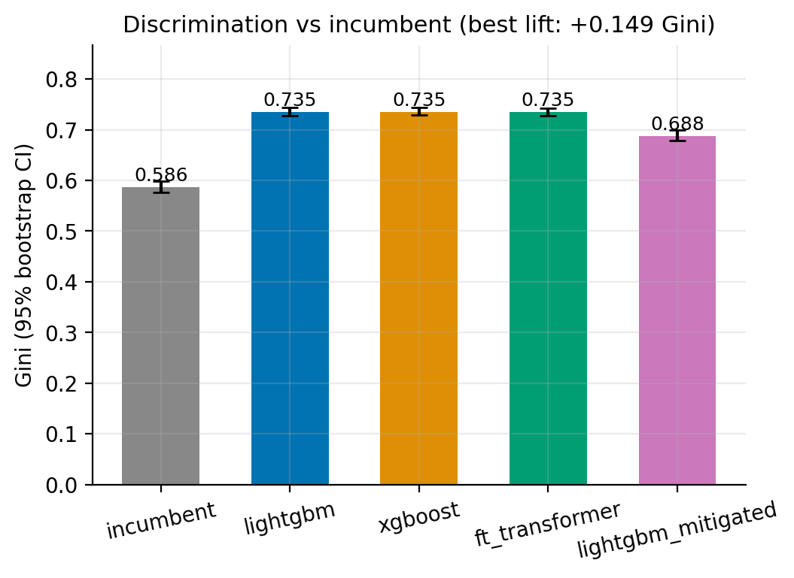

The deployed champion — after the fairness mitigation described below — improves on the incumbent by **+0.102 Gini**, with bootstrap confidence intervals nowhere near overlapping.

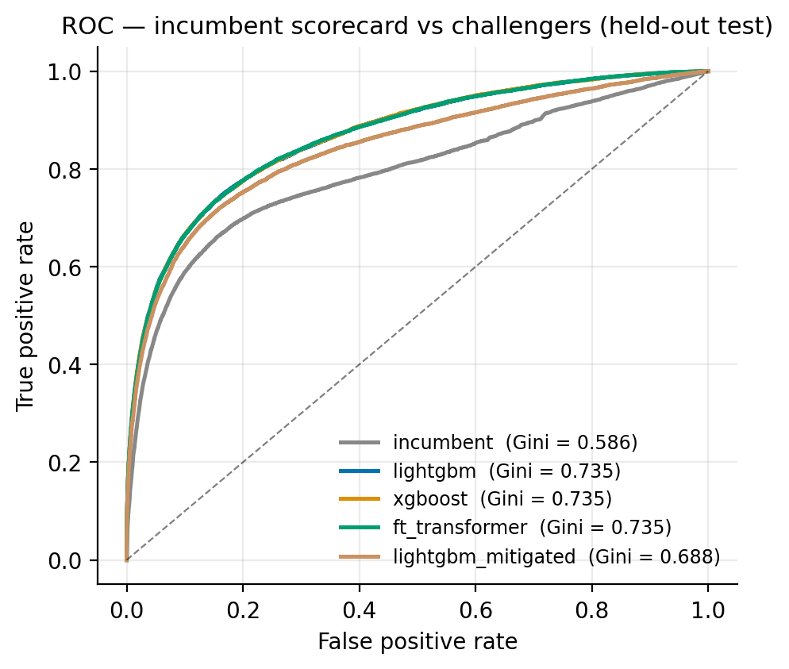

Calibration matters as much as rank-ordering for a PD model (prices, provisions, and capital all consume the probability, not the rank). The challenger's decile calibration hugs the identity line:

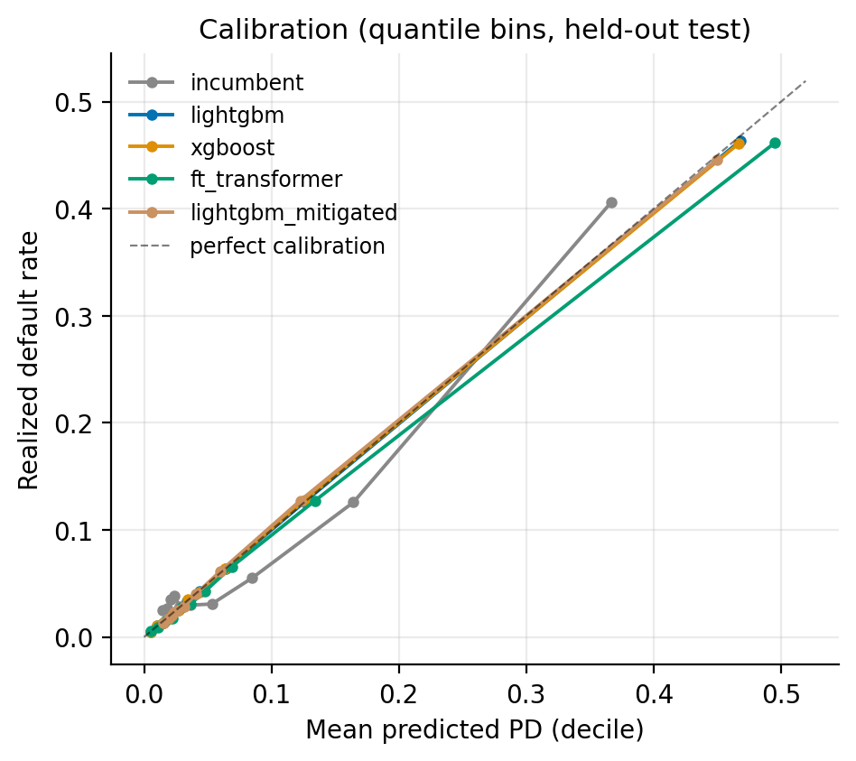

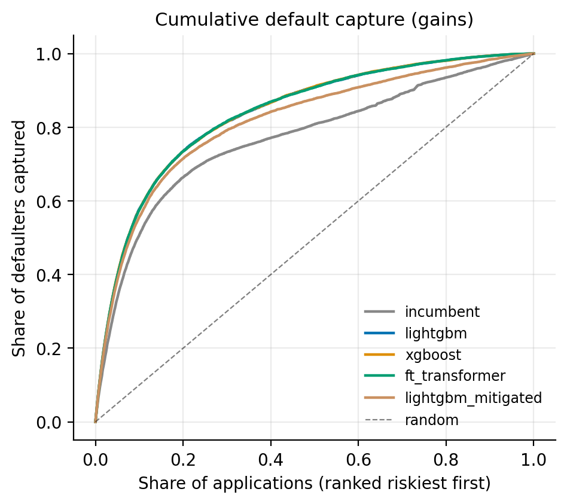

Worth pausing on the FT-Transformer row: a from-scratch transformer, trained on GPU over 800K rows, **exactly ties** the GBMs (Gini 0.735 vs 0.735) — and beats them nowhere. On tabular credit data, the deep model didn't earn its complexity or its opacity. In a governance context that's not a failed experiment; it's the documented evidence a validator asks for when the modeling team claims the simpler model suffices.

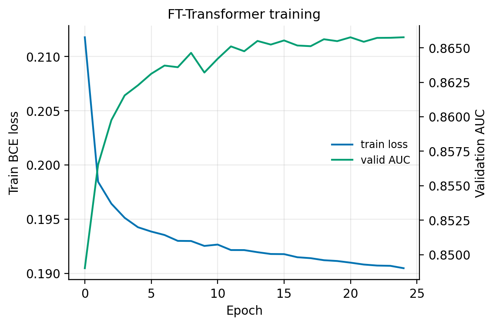

## 4. Explainability: SHAP from global behavior to the decline letter

Global SHAP analysis confirms the model learned the simulated economics — utilization, DTI, and the savings buffer dominate, with the direction of each effect visible at a glance:

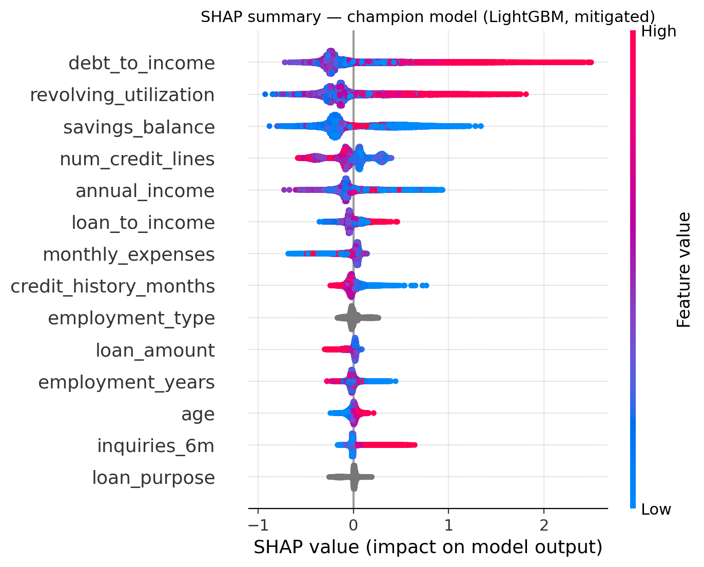

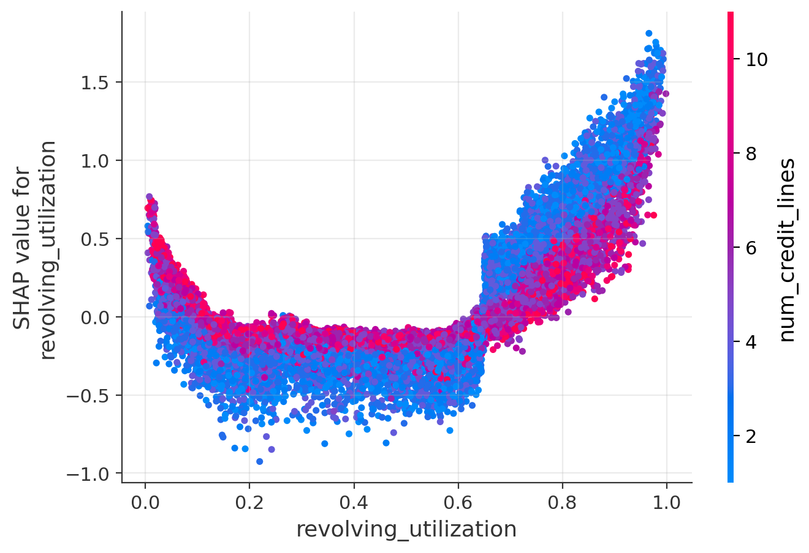

The regulatory requirement, though, is *local*: every declined applicant must receive the **principal reasons** for the decision (ECOA / Regulation B). Because SHAP values are additive — they sum exactly to the model's score margin — the top positive contributions *are* the principal reasons, faithfully by construction rather than by post-hoc rationalization. Each feature maps to standardized adverse-action language. A live example from the scoring API (PD 76.6% vs a 4.76% cutoff):

```
1. [R02] Debt obligations are too high relative to income        (DTI 0.52,        +1.25)
2. [R01] Proportion of revolving balances to credit limits is
         too high                                                 (utilization 0.91, +0.97)
3. [R10] Insufficient deposit or savings balances                 (savings $400,     +0.74)
4. [R05] Too many recent inquiries for credit                     (4 in 6 months,    +0.48)
```

One subtlety surfaced while reviewing generated notices: SHAP can assign a large positive contribution to an *anomalously low* value — one applicant with a debt-to-income of exactly 0.0 drew "[R02] Debt obligations are too high relative to income" as the top reason, because the model treats DTI ≈ 0 as unusual. The contribution was real; the sentence was false. The fix is a **directional consistency guard**: every reason's language makes a claim ("too high", "insufficient"), and a reason is only stated when the applicant's value actually sits on that side of the development-population median — otherwise the next-ranked consistent contributor takes its place. Faithful attribution and truthful language are different requirements, and an adverse-action system needs both.

The same logic runs in a FastAPI service (`POST /score` → PD, points score, decision, reason codes), so the adverse-action path is production-shaped, not a notebook artifact.

## 5. The fairness audit catches the planted evidence

Decisions approve the lowest-PD applicants at a 70% approval rate. At that threshold, each protected attribute is tested for adverse-impact ratio (the EEOC four-fifths rule), demographic parity, equal opportunity, and within-group calibration.

This is where the naive challenger's extra Gini unravels:

| variant | Gini | group AIR | verdict |
|---|---|---|---|
| incumbent scorecard | 0.586 | 0.934 | passes — but weak discrimination |
| naive challenger (uses geo index) | 0.735 | **0.777** | **fails the four-fifths rule** |
| **champion (geo index removed)** | 0.688 | **0.981** | **passes** |

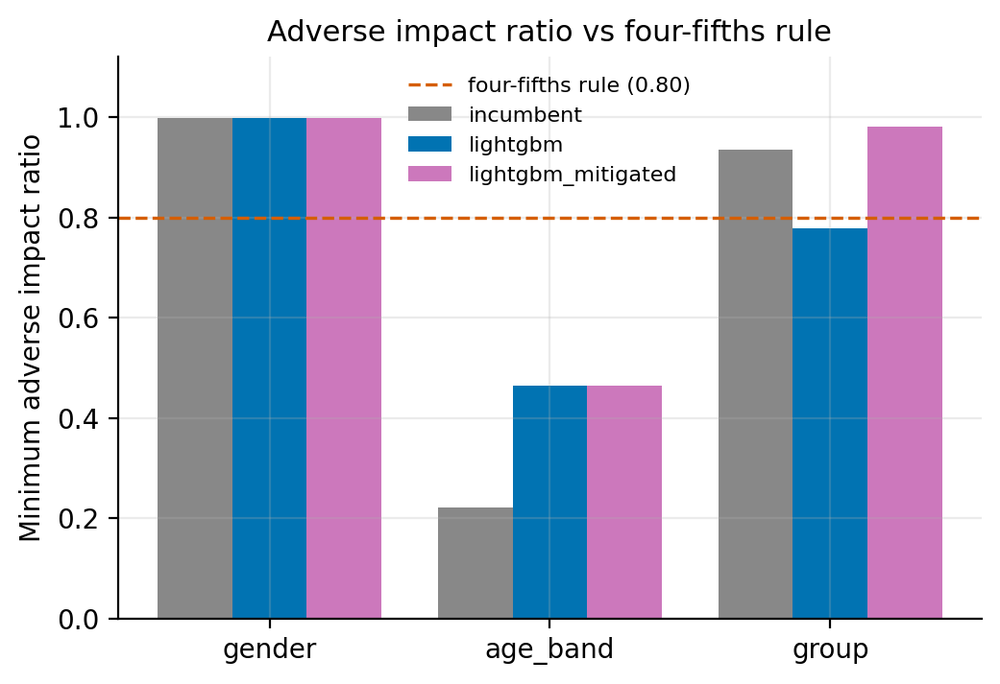

The naive challenger approves 72.4% of group A and only 56.2% of group B — a 16.1-point gap, with an equal-opportunity gap of 17.1 points among applicants who in fact would have repaid. And the ground truth says this is pure bias: group B's true default rate in the simulation is slightly *lower* than group A's.

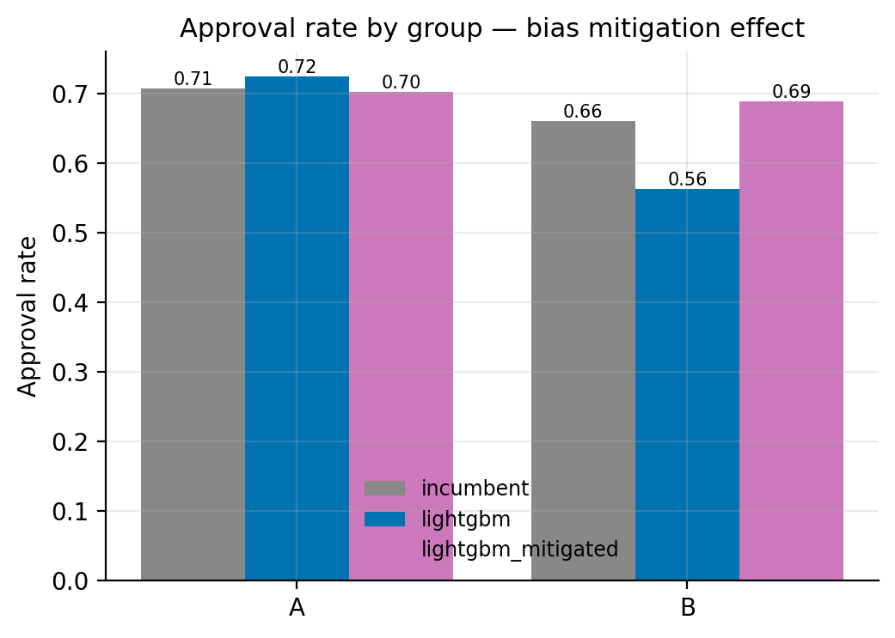

The mitigation was feature exclusion: drop `geo_risk_index`, retrain. Group B's approval rate recovers from 56% to 69% (AIR 0.981) at a cost of 0.047 Gini relative to the naive model — while keeping the full +0.102 lift over the incumbent. Three details worth noting honestly:

- **Gender behaves as a negative control** (AIR ≈ 1.0 in every variant) — the audit doesn't cry wolf where no bias was injected.
- **Age-band disparities persist in every model** (AIR well below 0.8), but within-group calibration gaps are ≈ 0: younger applicants genuinely default more in this portfolio (thin files, short histories). The audit distinguishes risk differentiation — permitted for empirically derived systems under ECOA — from bias. A test that can't make that distinction would flag every credit model ever built.
- **The income measurement bias survives feature exclusion** — it enters through legitimately predictive ratios and can't be dropped. It's documented as a finding requiring data-quality remediation, not silently absorbed. Not every bias has a modeling fix.

## 6. What it's worth in dollars

Swap-set analysis on the held-out book, annualized to 800K applications (LGD 0.55):

| | incumbent | champion |
|---|---|---|
| expected annual default losses at 70% approval | $71.6M | $57.8M |
| **annual loss reduction** | | **$13.8M (−19.2%)** |
| approval rate at *constant* losses | 70.0% | **77.25%** |
| additional approvals per year at constant risk | | **+57,998** |

The same Gini lift can be spent two ways: hold volume and cut losses, or hold losses and approve ~58,000 more applicants a year — including restoring the approvals the biased feature had been denying group B. On the test book, 12,956 applicants swap in (approved by the champion, declined by the incumbent) and 12,956 swap out.

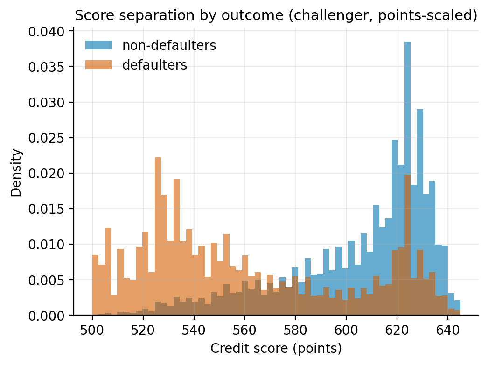

## 7. The model zoo: twelve architectures, one surprise

With the champion deployed, a second benchmark asked a harder question: was gradient boosting even the right call? Twelve variants, all trained under the *approved feature policy* (no geo index), all measured uniformly — Gini with bootstrap CIs, KS, Brier, expected calibration error, and scoring latency:

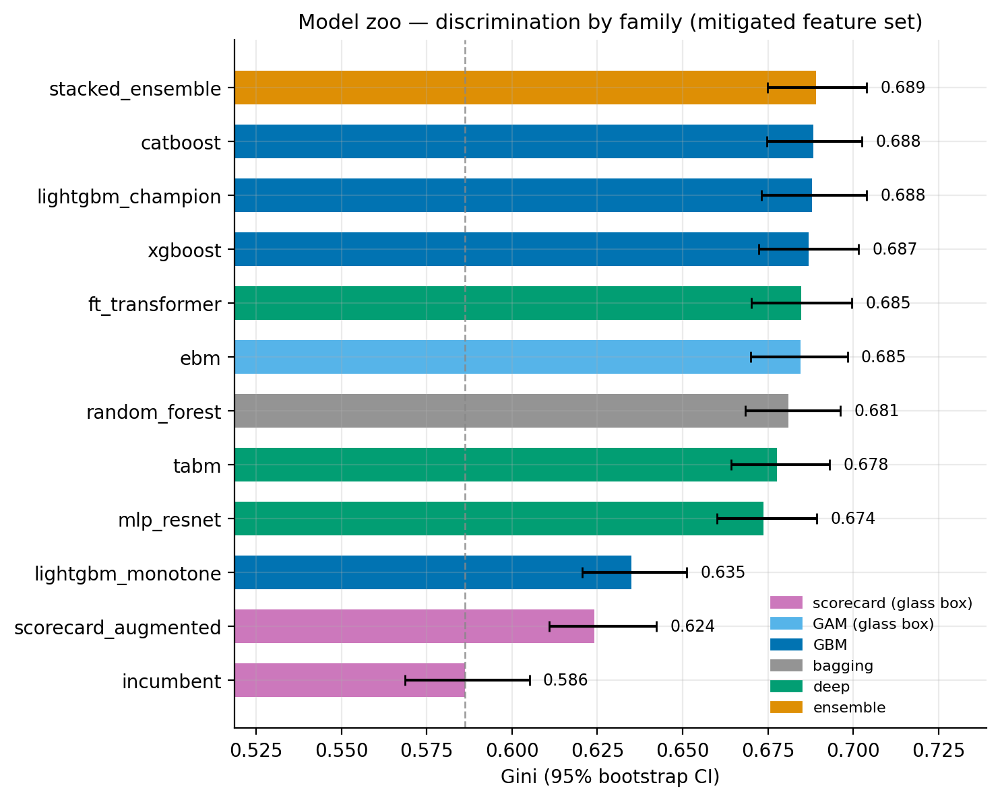

| model | family | Gini | what it tested |
|---|---|---|---|
| stacked ensemble | ensemble | 0.689 | the ceiling when families blend |
| catboost | GBM | 0.688 | GBM triad agreement |
| **lightgbm (champion)** | GBM | 0.688 | deployed model |
| xgboost | GBM | 0.687 | |
| ft_transformer | deep | 0.685 | tokenized transformer |
| **ebm** | **GAM (glass box)** | **0.685** | **interpretable-by-design GAM + pairwise interactions** |
| random_forest | bagging | 0.681 | boosting vs bagging |
| tabm | deep | 0.678 | BatchEnsemble MLP (NeurIPS 2024), from scratch |
| mlp_resnet | deep | 0.674 | strong deep baseline |
| lightgbm_monotone | GBM | 0.635 | the price of monotone constraints |
| scorecard_augmented | scorecard | 0.624 | GBM-distilled cross terms in the incumbent's architecture |
| incumbent | scorecard | 0.586 | baseline |

Four findings stand out.

**The glass box kept 97% of the lift.** The Explainable Boosting Machine — a GAM where every term, including its 15 learned pairwise interactions, is a plottable shape function — reached Gini 0.685 against the champion's 0.688. On this portfolio, once interactions are representable, the black box buys three thousandths of a Gini point. For a risk committee weighing interpretability against accuracy, that reframes the entire conversation.

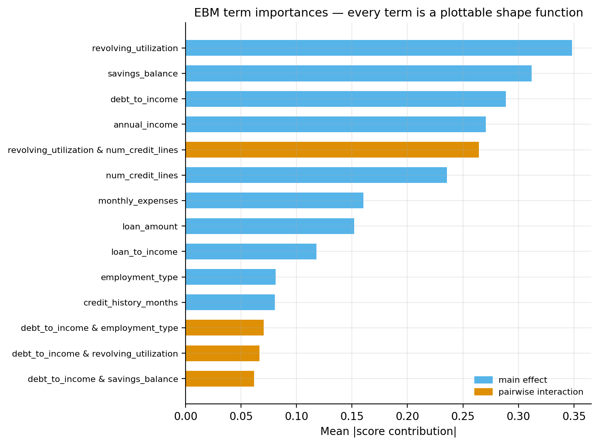

**Two independent methods recovered the true data-generating process.** The augmented-scorecard experiment extracted the top SHAP *interaction* pairs from the trained GBM: `utilization × num_credit_lines`, `DTI × utilization`, `DTI × savings`, `loan_to_income × savings`. Those are, almost verbatim, the thin-file, distressed-revolver, and liquidity-buffer regimes hard-coded into the simulator. Separately, the EBM's own interaction detector (FAST) chose `utilization & num_credit_lines` as its top pair. Neither method was told the answer; both found it. Grafting six of those crosses onto the incumbent scorecard — no architecture change, still a points-based additive model — recovered **37% of the champion's lift** (+0.038 Gini).

**Monotonicity has a price, and here it's steep.** Constraining 11 of 16 features to regulator-friendly directions (PD non-decreasing in utilization, delinquencies, DTI; non-increasing in income, savings, tenure) cost **0.053 Gini**. That's because this portfolio's risk is genuinely regime-dependent — the same high utilization is bad or benign depending on context — and the deliberately *unconstrained* features (like `num_credit_lines`) are exactly the ones where forcing a direction would be wrong. A unit test verifies the constrained model's PD really is monotone on a feature grid.

**Ensembling found nothing left.** A logit-stack of LightGBM, XGBoost, CatBoost, and TabM beat the single champion by +0.001 Gini. The families are extracting the same signal; the remaining gap to the oracle is noise, not architecture.

There's also an operational axis — at scoring time the GBMs and the glass-box models cost ~1ms per thousand applicants, while the transformer costs ~8ms (and wants a GPU):

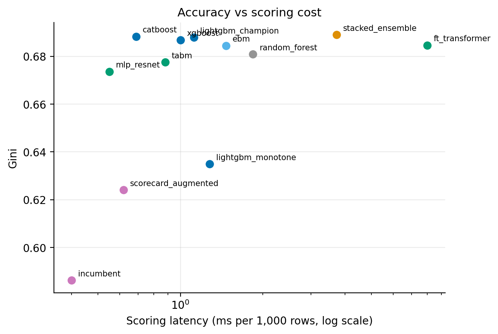

And a calibration coda: an isotonic layer fitted on validation did *not* improve the champion (ECE 0.0022 → 0.0024) — it was already well calibrated. The layer ships anyway, because recalibration is the first response to drift in the monitoring plan, and it's better to have the mechanism rehearsed than invented during an incident.

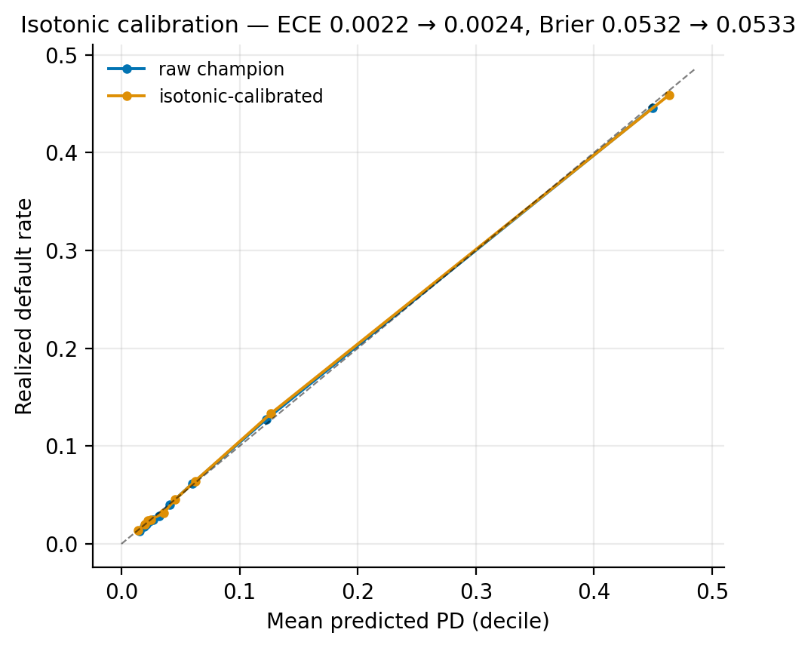

## 8. Where the feature engineering happened

A reasonable question for any credit model: how much of the performance is the algorithm, and how much is the representation? This project does feature engineering at four layers, each with a different job:

1. **Domain ratios as base features.** The simulator emits the ratios real underwriting runs on — debt-to-income, loan-to-income, utilization — rather than raw balances. The scoring API recomputes `loan_to_income` from raw inputs at request time, so the engineering is part of the served contract, not a notebook step. The Home Credit companion pipeline does the same on real data: `credit_to_income`, `annuity_to_income`, `credit_to_goods`, `payment_years`, plus bureau-table aggregates (active-loan counts, max days overdue, debt ratios).
2. **Weight-of-evidence transformation.** The incumbent's entire feature space is engineered: every characteristic is quantile-binned and re-expressed as the log-odds evidence of its bin. This is the classic credit-risk representation — it linearizes arbitrary per-feature shapes so logistic regression can consume them, and it's exactly *why* the incumbent's weakness had to be interactions rather than shapes.
3. **GBM-distilled interaction crosses.** The augmented scorecard is a pure feature-engineering experiment: use the black box as a *feature discovery* tool (top SHAP interaction pairs), materialize those pairs as explicit product features, re-bin, and hand them to the incumbent's own architecture. 37% of the challenger lift, zero new model risk.
4. **Learned representations for the deep models.** Standardized numerics with per-feature affine tokens (FT-Transformer) or small categorical embeddings concatenated into a flat vector (ResNet, TabM) — representation learning as the *alternative* to manual engineering, which on this data didn't outperform it.

The honest summary: on this portfolio, **representation beat architecture**. Giving an additive model the right six crosses closed more of the gap than swapping a GBM for a transformer.

## 9. Governance, because none of this ships without it

The repository treats documentation as a deliverable, not an afterthought:

- **[Model card](docs/MODEL_CARD.md)** — intended use, data, performance, fairness posture, known limitations.
- **[Validation report](docs/VALIDATION_REPORT.md)** — structured per SR 11-7 (conceptual soundness, development evidence, outcomes analysis, fair-lending review), with a findings log: the simulated-data limitation, the unresolved income measurement bias, the recalibration triggers.
- **[Monitoring plan](docs/MONITORING_PLAN.md)** — PSI thresholds, Gini and calibration drift bands, *fairness drift* (quarterly AIR re-testing), override-rate tracking, and the escalation path back to the incumbent scorecard, which stays warm as a fallback artifact.
- **[Fairness report](reports/FAIRNESS_REPORT.md)** and **[adverse-action samples](reports/adverse_action_samples.txt)** — generated fresh on every pipeline run.

## 10. What I'd build next

- **Default timing.** The simulator currently emits a binary outcome; adding a months-to-default hazard would unlock discrete-time survival models and IFRS-9-style lifetime expected loss curves.
- **In-processing fairness.** Feature exclusion worked here because the bias had a single carrier. Comparing it against reductions-based constrained optimization (e.g., fairlearn's exponentiated gradient) on the measurement-bias mechanism — which exclusion *can't* fix — is the natural follow-up.
- **The real-data leg.** The Home Credit pipeline (307K real applications) is built and waiting on Kaggle credentials; running the same scorecard-vs-challenger comparison there closes the validation report's highest-severity finding.

---

*Reproduce everything: `python scripts/run_pipeline.py` (core pipeline, ~12 min with GPU) and `python scripts/run_model_zoo.py` (extended benchmark, ~20 min). Data, splits, and seeds are fixed; the figures in this article are the actual pipeline outputs committed to the repo.*
